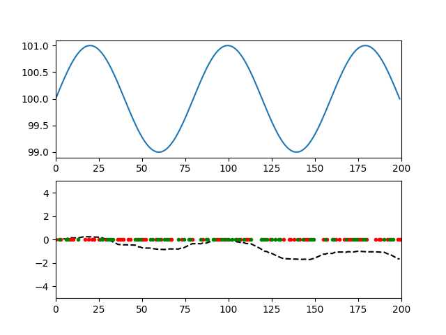
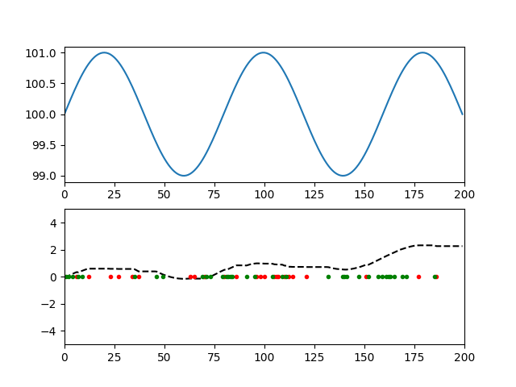
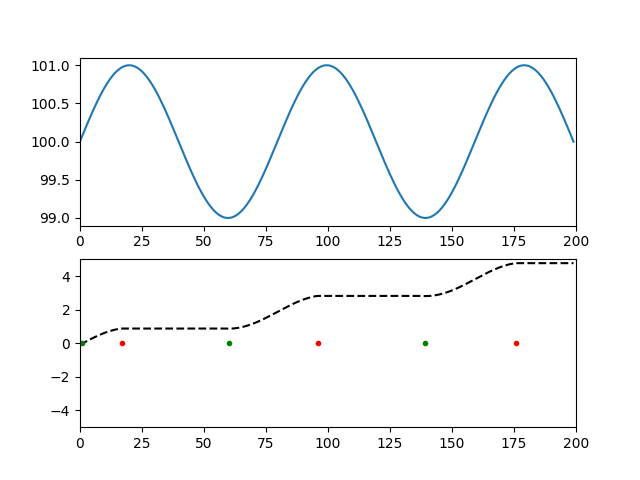

# Deep Q-learning for sinusoidal stock price

This is an example of deep Q-learning for an academic, sinusoidal stock price.
The Q-value function is approximated by a two-layer DNN with 128 neurons per layer.

The example has been inspired by: https://keras.io/examples/rl/deep_q_network_breakout/

In our example, the algorithm finds the optimal strategy in about 100 episodes of training.

